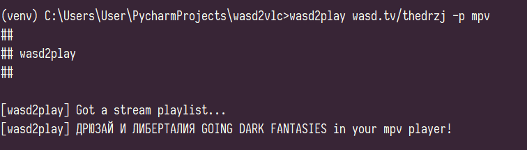

# Wasd2Play



Open any stream in your favorite player!

### Requirements
`pip install -r requirements.txt`

### Help
```
usage: wasd2play [options] url

Open any stream in your favorite player!

positional arguments:
  url             stream url

optional arguments:
  -h, --help      show this help message and exit
  -p YOUR_PLAYER  point your player
```